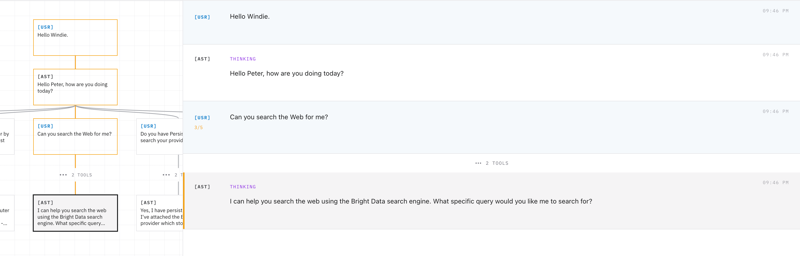
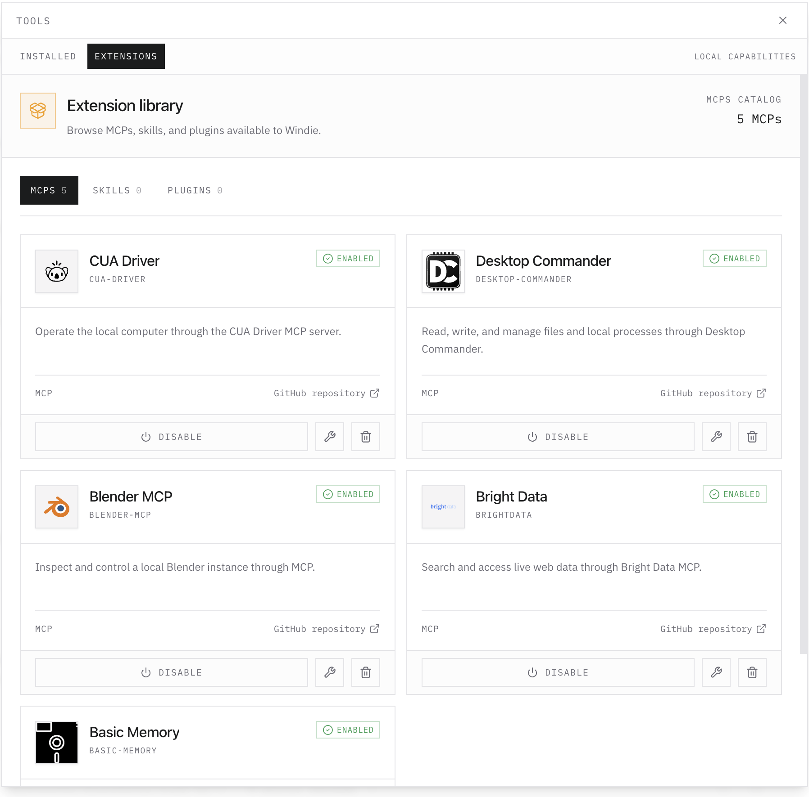
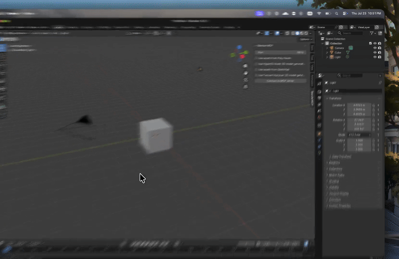
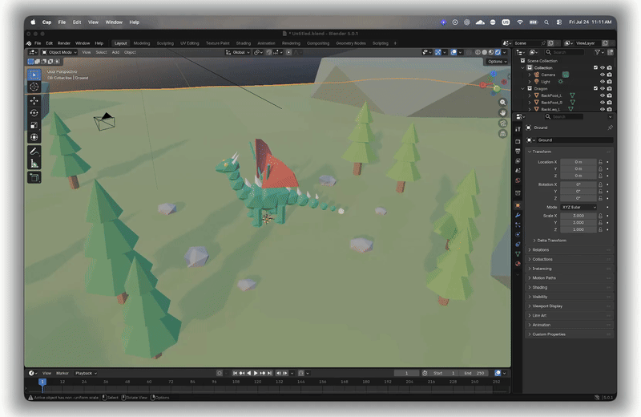
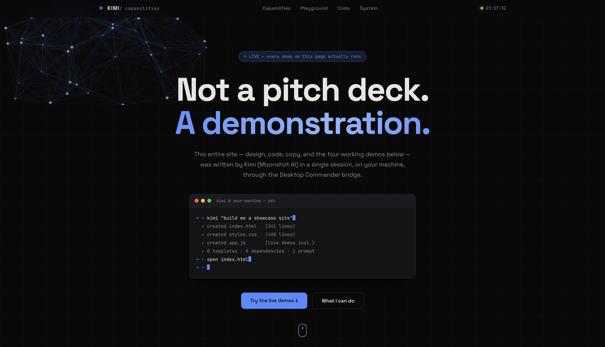

<p align="center">
  
</p>

# Windie
<p align="center">
  <a href="https://github.com/buiilding/Windie-Sandbox">Windie</a> | <a href="https://windieos.com">Website</a>
</p>
<p align="center">
  <a href="https://github.com/buiilding/Windie-Sandbox/releases"></a>
  <a href="https://windieos.com/docs"></a>
  <a href="https://discord.gg/windie"></a>
  <a href="LICENSE"></a>
  <a href="https://github.com/buiilding/Windie-Sandbox/actions"></a>
  <a href="AGENTS.md"></a>
</p>

**AI that lives on your computer.**

Windie is a local AI runtime written in Rust that lets you control what your AI sees. Edit, add, or remove messages, branch from any point, and keep every path in one conversation tree. Its daemon keeps sessions running independently of the UI, with permissioned tools and open extensions.

```bash
curl -sL https://windieos.com/install | sh
```

On Windows PowerShell:

```powershell
irm https://windieos.com/install.ps1 | iex
```

The installer starts the simple Windie tray controller along with Bifrost, the
Windie API, and the standalone Inspector as independent local processes. The
tray invokes these CLI lifecycle commands:

```bash
windie gateway start|stop|output
windie api start|stop|output
windie inspector start|stop|output
```

## Repository development workflow

The public `windie` binary is the runtime CLI. Repository-only development,
release packaging, and benchmarks live in the separate `windie-dev` binary:

```bash
source ./scripts/activate_windie-dev
windie-dev dev up                 # build/start gateway and API, HMR Inspector
windie-dev dev status
windie-dev dev down

windie-dev release build
windie-dev release install
windie-dev release verify
source ./scripts/activate_windie
windie status
```

`windie-dev` is built from the checkout and is not included in public release
archives. In development, React uses HMR. The Rust API and Bifrost gateway are
built when `windie-dev dev run` or `windie-dev dev up` starts them; rerun the
command after backend source changes. The release Inspector embeds the
frontend and is intentionally not hot reloaded; use `windie-dev dev up` for UI
development. Installations in separate
worktrees can run together by assigning distinct
`WINDIE_GATEWAY_PORT`, `WINDIE_API_PORT`, and `WINDIE_INSPECTOR_PORT` values.

---

## What Windie Is

Windie is the runtime beneath your AI—not another chat app. It runs locally and gives you direct control over the context your AI receives: edit, add, or remove messages; branch from any point; and keep every path in one conversation tree. Its daemon keeps the work running independently of the Inspector, while agents, tools, and workflows build on top.

Three principles guide everything Windie does:

- **Context is yours** — Edit what the AI sees and branch without losing the original.
- **Execution persists** — Sessions continue independently of the interface.
- **The system stays open** — Bring your own models, tools, providers, and workflows.

---

## Full Control Over Context

<p align="center">
  
</p>

Conversations in Windie aren't flat chat logs — they're **trees**.

Every conversation is made up of **sessions**, and each session is a **branch**: a specific path through the tree that defines exactly what context gets sent to the LLM. Branch off at any point, explore a different direction, and come back — nothing is overwritten, nothing is lost.

And because you can see the whole tree, you can edit it:

- Modify or delete any message — yours, the assistant's, even tool calls and tool outputs
- Rewrite history to steer a conversation without starting over
- Curate exactly what context the model sees, message by message

No black-box context window. You control what the AI knows, every step of the way.

---

## Extensions for the Harness

<p align="center">
  
</p>

Windie's capabilities come from a growing **registry** of MCPs, plugins, and skills.

Windie doesn't ship with a fixed toolbox — it can **give itself tools based on the context of your task** in order to get the job done.

Two built-in tools drive this:

| Tool | Purpose |
|---|---|
| `list_providers` | Discover which tool providers are available |
| `attach_provider` | Attach a provider on demand, mid-conversation |

When a task needs a capability Windie doesn't currently have attached, it looks, finds it, and attaches it — live, in front of you.

### MCPs (6)

| Provider | Author | Description |
|---|---|---|
| **Cua Driver** | trycua | Native computer-use driver — click, type, and navigate your desktop like a human would |
| **Blender** | ahujasid | Model, light, and render from a prompt |
| **Desktop Commander** | wonderwhy-er | Filesystem, shell, and process control |
| **Basic Memory** | basicmachines-co | Portable, plain-text, persistent knowledge |
| **Brightdata** | brightdata | Fetch the live web, at scale |
| **Chrome DevTools** | Chrome DevTools team | Inspect, debug, and automate a separate persistent Chrome session |

#### Cua Preview

<p align="center">
  
</p>

#### Blender Preview

<p align="center">
  
</p>

#### Desktop Commander Preview

<p align="center">
  
</p>

### Plugins (0)
*Coming soon.*

### Skills (0)
*Coming soon.*

The registry is open — anyone can build and publish new MCPs, plugins, and skills for the harness.

---

## Model Providers

Windie is model-agnostic. Bring your own key, run locally, or use whatever provider fits your workflow. Currently supported:

Anthropic · Azure · Bedrock · Bedrock Mantle · Cerebras · Cohere · Deepseek · Elevenlabs · Fireworks · Gemini · Groq · Huggingface · Mistral · Nebius · Ollama · OpenAI · Opencode Go · Opencode Zen · OpenRouter · Parasail · Perplexity · Replicate · Runware · Runway · Sarvam · SGL · Vertex · vLLM · Wafer · xAI

Configure any provider with a simple API key — or run fully local with Ollama, SGLang, or vLLM.

> **Recommended setup:** Kimi K2, via a Kimi Code subscription (not the raw Moonshot API). Kimi Code is subscription-based rather than usage-metered, so you get significantly more usage for the price — and Kimi K2 holds up well against much more expensive frontier models at a fraction of the cost.

---

## Why Windie

- **No cloud lock-in** — swap models and providers freely
- **No black boxes** — inspect every tool call, every context change, every decision
- **No fixed toolbox** — Windie extends itself as your tasks demand
- **No bloat** — one install script, one quiet harness

---

## Get Started

```bash
curl -sL https://windieos.com/install | sh
```

- [Documentation](#)
- [Registry](#)
- [GitHub](#)

---

*Put AI where your computer is.*
